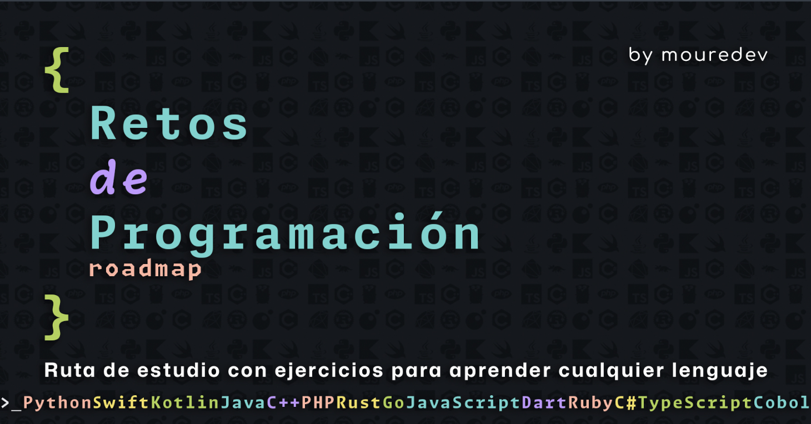

# Roadmap retos de programación semanales 2024

### Ruta de estudio con ejercicios para mejorar tu lógica de programación y aprender cualquier lenguaje. Gratis, a tu ritmo y en comunidad.

#### [https://retosdeprogramacion.com/roadmap](https://retosdeprogramacion.com/roadmap)

## Ranking de lenguajes y usuarios

#### ¿Estás participando en los retos? Ahora puedes consultar el ranking de usuarios y lenguajes según su número de contribuciones.

#### [https://retosdeprogramacion.com/roadmap/ranking](https://retosdeprogramacion.com/roadmap/ranking)

## Información importante

- Cada semana se publica un nuevo reto y se corrige en directo desde **[Twitch](https://twitch.tv/mouredev)** el ejercicio de la semana pasada.
- En la sección "Eventos" de nuestro servidor de **[Discord](https://discord.gg/mouredev)** encontrarás el día y horario por país de los directos.
- Puedes utilizar **cualquier lenguaje de programación**, y encontrar tanto mis correcciones como las de la comunidad en el directorio de cada reto.
- **¿Quieres participar?** Te lo explico en la sección **[Instrucciones](https://github.com/mouredev/roadmap-retos-programacion#instrucciones)** en este mismo documento.
- Los retos siguen un orden basado en su ruta de estudio pero si ya tienes conocimientos puedes resolverlos de manera totalmente independiente. Simplemente revisa su nivel de dificultad.
- Una vez se haya cumplido la semana de publicación del reto, podrás consultar mi corrección y las de la comunidad en cualquier lenguaje de programación.

> Consulta la [web](https://retosdeprogramacion.com/roadmap) para más información.

## Roadmap

| #   | Ejercicio                                          | JS        | PY        |     |
| --- | -------------------------------------------------- | --------- | --------- | --- |
| 00  | [SINTAXIS, VARIABLES, TIPOS DE DATOS Y HOLA MUNDO] | [&check;] | [&check;] |
| 01  | [OPERADORES Y ESTRUCTURAS DE CONTROL]              | [&check;] | [&check;] |
| 02  | [FUNCIONES Y ALCANCE]                              |
| 03  | [ESTRUCTURAS DE DATOS]                             |
| 04  | [CADENAS DE CARACTERES]                            |
| 05  | [VALOR Y REFERENCIA]                               |
| 06  | [RECURSIVIDAD]                                     |
| 07  | [PILAS Y COLAS]                                    |
| 08  | [CLASES]                                           |
| 09  | [HERENCIA Y POLIMORFISMO]                          |
| 10  | [EXCEPCIONES]                                      |
| 11  | [MANEJO DE FICHEROS]                               |
| 12  | [JSON Y XML]                                       |
| 13  | [PRUEBAS UNITARIAS]                                |
| 14  | [FECHAS]                                           |
| 15  | [ASINCRONÍA]                                       |
| 16  | [EXPRESIONES REGULARES]                            |
| 17  | [ITERACIONES]                                      |
| 18  | [CONJUNTOS]                                        |
| 19  | [ENUMERACIONES]                                    |
| 20  | [PETICIONES HTTP]                                  |
| 21  | [CALLBACKS]                                        |
| 22  | [FUNCIONES DE ORDEN SUPERIOR]                      |
| 23  | [SINGLETON]                                        |
| 24  | [DECORADORES]                                      |
| 25  | [LOGS]                                             |
|     |

## Autor

- **roddevwork**. Ejercicios hechos por mi
- En los siguientes lenguajes:
  - Javascript
  - Python
